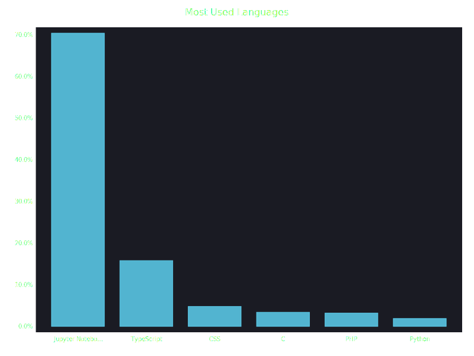

# Hi 👋, I'm João Gabriel Pacheco

<h3 align="center">18 anos • Estudante de Tecnologia na UEMA • Aluno na software house TheraLabs</h3>

- 🌱 Atualmente aprendendo **JavaScript**  
- 🎯 Explorando **React**, **TypeScript**, **Tailwind CSS** e **Firebase**  
- 📫 Como me encontrar: **joaogbsp@gmail.com**  
- ⚡ Fun fact: Procuro me especializar em **Fullstack**

---

## 📫 Conecte-se comigo

  
  
  

---

## 🛠 Languages and Tools

  
  
  
  
  
  
  
  
  
  

---

## 📊 Most Used Languages

> Este gráfico é gerado automaticamente por um GitHub Action que agrega **todos** os repositórios onde colaboro

---

## 📈 GitHub Stats

  

